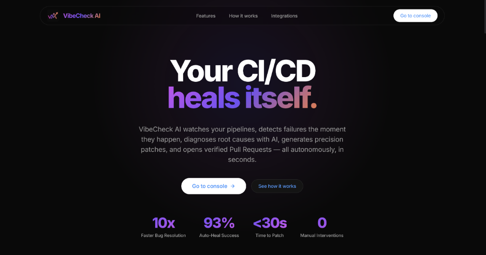
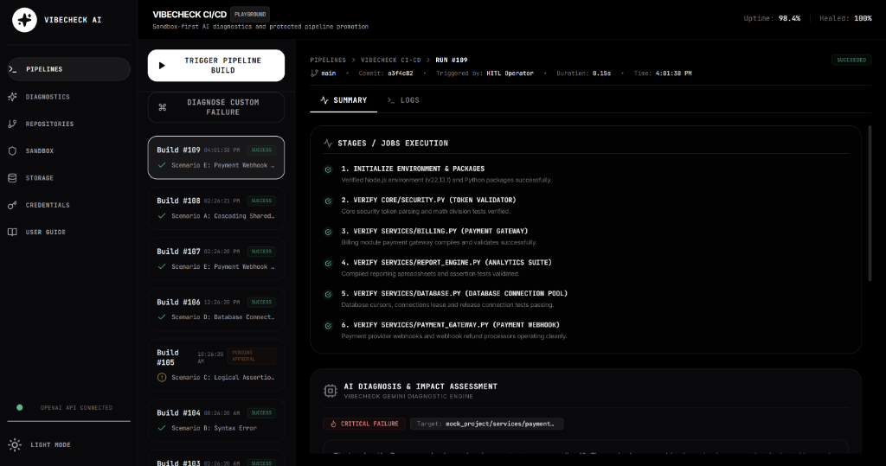
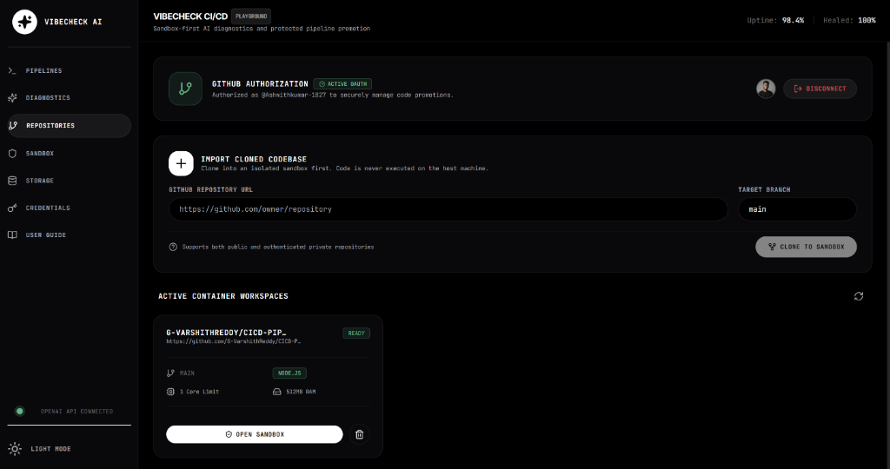
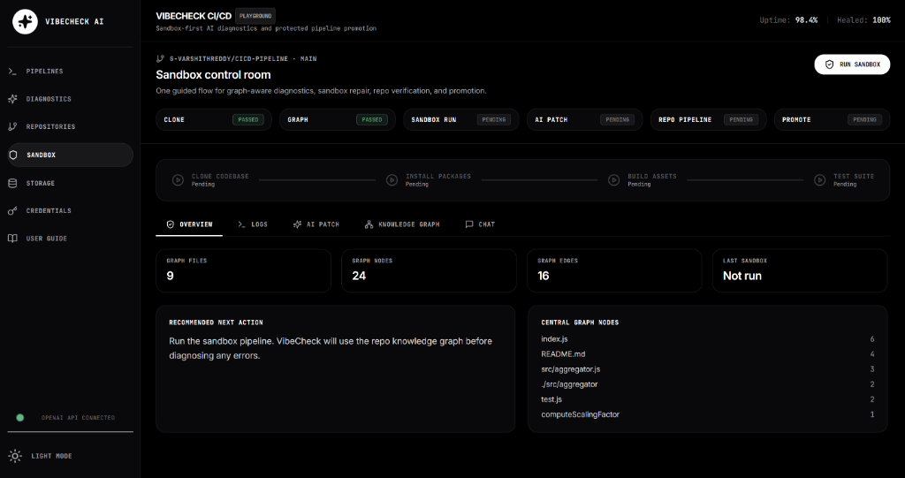

# VibeCheck AI ⚡ — Autonomous Self-Healing CI/CD Platform

[](https://github.com)
[](https://nextjs.org)
[](https://ai.google.dev)
[](https://www.docker.com)
[](https://opensource.org)

**VibeCheck AI** is an autonomous, self-healing developer automation platform. By directly wrapping your CI/CD execution pipeline with active AI-driven diagnostic layers, it catches compilation and runtime test failures inside isolated sandbox environments, diagnoses root causes, generates precision patches, verifies the healed code, and opens PRs on GitHub—all in seconds without human manual log parsing.

---

## 🏗️ Core Architectural Features & Capabilities

VibeCheck AI is built around a secure, resilient, and zero-trust self-healing loop:

1.  **Multi-Model Gemini Fallback Chain**
    *   Features a prioritized multi-model routing chain: **Gemini 3.5 Flash** ➡️ **Gemini 3.1 Flash Lite**.
    *   Protects against rate-limiting or network latency using a strict **12-second `AbortController` timeout**. If the primary model fails or lags, the fallback model takes over automatically.
2.  **Isolated Subprocess & Docker Sandbox**
    *   Supports a hybrid container engine (`lib/container.js`). Clones repositories and executes pipeline scripts inside resource-capped disposable Docker containers (`Dockerfile.node` and `Dockerfile.python`).
    *   If Docker is inactive, falls back gracefully to file-isolated, non-shell execution environments in local scratch directories, keeping the host system secure.
3.  **Fuzzy Signature Block Matcher**
    *   Applies multi-line code patches using an indentation-agnostic, comment-agnostic fuzzy matching engine.
    *   Normalizes line-endings, whitespace, tabs, and comments to align AI-generated patches cleanly against disk source files without causing syntax collisions.
4.  **GitHub OAuth Promotion Flow**
    *   Authenticates via a secure OAuth app flow (`/api/github/auth` and `/api/github/callback`).
    *   Saves tokens securely in session state and on the server. Checks out clean temporary branches and creates rich Pull Requests containing full logs, diagnosis reports, and verification proofs.
5.  **Real-Time Log Streaming Console**
    *   Leverages Server-Sent Events (SSE) to push stdout/stderr logs directly from running pipeline executors to the browser dashboard in real time with full ANSI colors.

---

## 🛡️ Sandbox Isolation & Dependency Graph (Graphify) Architecture

To make VibeCheck AI safe and scalable for enterprise codebases, we solved two critical engineering challenges: **host execution security** and **cascading microservice dependencies**.

### 1. Why VibeCheck AI Enforces Sandbox Isolation (Security Concerns)
Running automated pipeline checks, dependency installations, and test runners (like `pytest` or `npm test`) directly on the host server poses severe security risks:
*   **Arbitrary Code Execution**: Testing unverified repositories exposes the host machine to malicious or unstable scripts that could hijack the server.
*   **Secrets Exposure**: Malicious dependency configurations or tests could access local environment variables, leaking your critical cloud keys, Personal Access Tokens, and database credentials.
*   **File System Contamination**: Unbounded code changes can corrupt the local OS directory structures or write backdoors to server storage.

**The Solution:**
VibeCheck AI implements a strict **Zero-Trust container boundary** using Docker Engine. All repository cloning, dependency resolution, script execution, and patch verification are isolated inside disposable, resource-constrained container wrappers (`Dockerfile.node` and `Dockerfile.python`). If Docker is not available on the development machine, it falls back to a highly isolated directory boundary with strict shell command sanitization. **No untrusted code is ever executed directly on your host server.**

### 2. Why VibeCheck AI Uses Codebase Knowledge Graphs (Graphify)
In modern microservice architectures, repositories are rarely self-contained. A failure in one service is often caused by a breaking change or bug inside a shared, common utility library:
*   **The symptom**: Downstream microservices crash, resulting in multiple failing pipeline logs across separate endpoints.
*   **The challenge**: An AI looking only at a single failing service log will try to patch the symptom locally rather than fixing the shared bug at its source, leading to code duplication or regression.

**The Solution:**
Upon importing a repository, VibeCheck parses the code imports, exports, classes, and method signatures into a visual **Dependency Knowledge Graph (Graphify)**. When a build fails, the Gemini diagnostic agent queries the Knowledge Graph to trace the import tree:
*   It visualizes the shared dependencies across all modules.
*   It identifies the root core dependency causing the cascade (for instance, a token verification bug in `core/security.py` breaking both `billing.py` and `report_engine.py`).
*   It generates a single, high-precision root-level patch that heals the entire downstream microservice suite in one operation.

---

## 📸 Platform Showcase

### 1. High-Fidelity Landing Page (Framer-Inspired)


### 2. Autonomic Pipelines Cockpit (Real-time Run Logs)


### 3. GitHub OAuth & Sandbox Repository Manager


### 4. Twin Container Sandbox Control Room


---

## 📂 Project Directory Structure

```
vibecheck-ai/
├── docker/
│   ├── Dockerfile.node        # Base runner image for Node.js pipelines
│   ├── Dockerfile.python      # Base runner image for Python/pytest pipelines
│   └── docker-setup.ps1       # Verifies Docker Daemon and builds base runner images
├── components/
│   ├── tabs/
│   │   ├── PipelineConsole.jsx   # Live console, SSE streams, stage progress
│   │   ├── RepoManager.jsx       # Repository clone, status, OAuth controls
│   │   ├── SandboxWorkspace.jsx  # Isolated verification, diff viewer, PR promoter
│   │   └── UserGuide.jsx         # Instructions and CLI cheatsheet
│   ├── ChatPanel.jsx          # Interactive human-in-the-loop diagnostic chat
│   ├── ConsoleLog.jsx         # Rendered logs with syntax/error highlighting
│   ├── DiagnosticCard.jsx     # AI reports, copy/download actions, PR triggers
│   ├── DiffViewer.jsx         # Side-by-side patch visualizer
│   ├── GitHubConnect.jsx      # GitHub OAuth status card
│   ├── Layout.jsx             # Shell sidebar navigation
│   ├── LiveConsole.jsx        # Terminal emulator with color rendering
│   └── StageProgress.jsx      # Horizontal stage status bar
├── lib/
│   ├── container.js           # Docker API/CLI container manager
│   ├── db.js                  # Transactional JSON database wrapper
│   ├── detector.js            # Auto-detects project language (Node/Python)
│   ├── executor.js            # Executes pipeline stages (Install -> Build -> Test)
│   ├── github.js              # GitHub REST API integrations (OAuth, Repo, PRs)
│   ├── openai.js              # Gemini multi-model fallback client
│   └── patcher.js             # Indentation-agnostic signature block patcher
├── pages/
│   ├── api/
│   │   ├── builds/            # Custom log diagnostics & database hooks
│   │   ├── container/         # Container run, SSE stream, and apply patch API
│   │   ├── github/            # OAuth authentication callback & status routes
│   │   ├── patches/           # Patch approval/rejection controllers
│   │   ├── repos/             # Repository registration and clone manager
│   │   ├── sandbox/           # Twin container verification & PR promotion routes
│   │   └── system/            # Database seed, refresh, and HMR ignore reset API
│   ├── index.js               # Main Dashboard Console
│   └── landing.js             # High-fidelity Translucent Glass Landing Page
├── styles/
│   ├── globals.css            # Dark mode variables & dashboard layouts
│   └── landing.css            # Translucent floating navbar & connected workflow tree
├── next.config.js             # Webpack watcher exclusions for HMR stability
├── repos.json                 # Local repository metadata storage
└── db.json                    # Active build pipeline database
```

---

## 🔒 Security Hardening & Stability

VibeCheck AI is built for secure enterprise integration:

*   **Path Traversal Interceptors**: All file reads/writes in `/api/patches/[id]/approve` and custom triage directories are sanitized via absolute path validation (`path.resolve`). File changes are strictly locked to the sandbox workspace.
*   **Zero-Trust Command Execution**: Pipeline execution parameters are fully defined statically on the server. Command strings are never assembled using string concatenation from user-supplied inputs, preventing shell injection vectors.
*   **Next.js HMR Watcher Isolation**: The Next.js dev watcher is explicitly configured in `next.config.js` to ignore database modifications (`db.json` and its database temp/backup variants). Updating the build database during chat runs will **never** trigger hot-reloads, maintaining React frontend state integrity.
*   **No-Write SaaS Mode**: Pasteurizing and triaging custom log logs or original file trace uploads executes in-memory. The server does not write anything to disk unless the repository is cloned inside a sandboxed container boundary.

---

## 🚀 Installation & Setup

### Prerequisites
*   **Node.js**: v18.x or later
*   **Python 3.x & pytest** (Optional, falls back to a high-fidelity execution simulator)
*   **Docker Desktop** (Optional, falls back to a secure file-sandbox simulator if Docker is offline)

### Step 1: Clone and Boot the Dev Server
To initialize package dependencies, seed the mock database, and launch the platform:
```powershell
.\start.ps1
```

### Step 2: Configure API Credentials
Open the generated `.env` file in the root of the project and add your API credentials:
```env
# Gemini API Key (Required for live diagnostics)
GEMINI_API_KEY=...

# GitHub OAuth App Details (Required for GitHub connections)
GITHUB_CLIENT_ID="your_client_id"
GITHUB_CLIENT_SECRET="your_client_secret"
```

*Note: Restart Next.js dev server after editing `.env` to apply changes.*

### Step 3: (Optional) Build Docker Base Images
If using Docker containers for sandboxing, verify that Docker is running and execute:
```powershell
powershell -File ./docker/docker-setup.ps1
```
This builds `vibecheck-node` and `vibecheck-python` images to support native container executions.

---

## 🤖 The Self-Healing Workflow (How it Works)

```
[git commit/push] ➔ [Trigger Build API] ➔ [Clone Repo into Container]
                                                        │
[Build Passed] 🖲️ Merged                                ▼
    ▲                                           [Pipeline Failed]
    │                                                   │
[Twin Sandbox Re-Test Passes]                           ▼
    ▲                                           [Read Traceback Logs]
    │                                                   │
[Approve Patch] 🗪 Chat Vetting                          ▼
    ▲                                           [Gemini Double-Pass Triage]
    │                                                   │
    └────────────────────────────────────────── [Generate Code Patch]
```

1.  **Trigger Pipeline**: An install, build, or test stage fails.
2.  **Double-Pass Triage**: Gemini reads the traceback logs, extracts the buggy files relative to the repository path inside the sandbox container, and generates a block diff.
3.  **Chat Vetting**: The developer uses the chat panel to ask questions about the patch, test safety, or modify implementation details.
4.  **Approve**: Clicking "Approve & Execute Patch" runs the signature matcher to patch the code inside the container, re-running the test suite automatically to confirm the fix.
5.  **Promote**: Creates a git branch, commits the fix, and pushes a complete Pull Request onto GitHub with the verification proofs attached.
